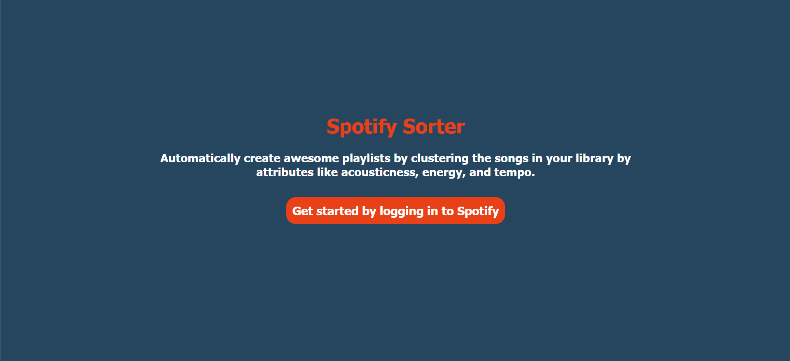
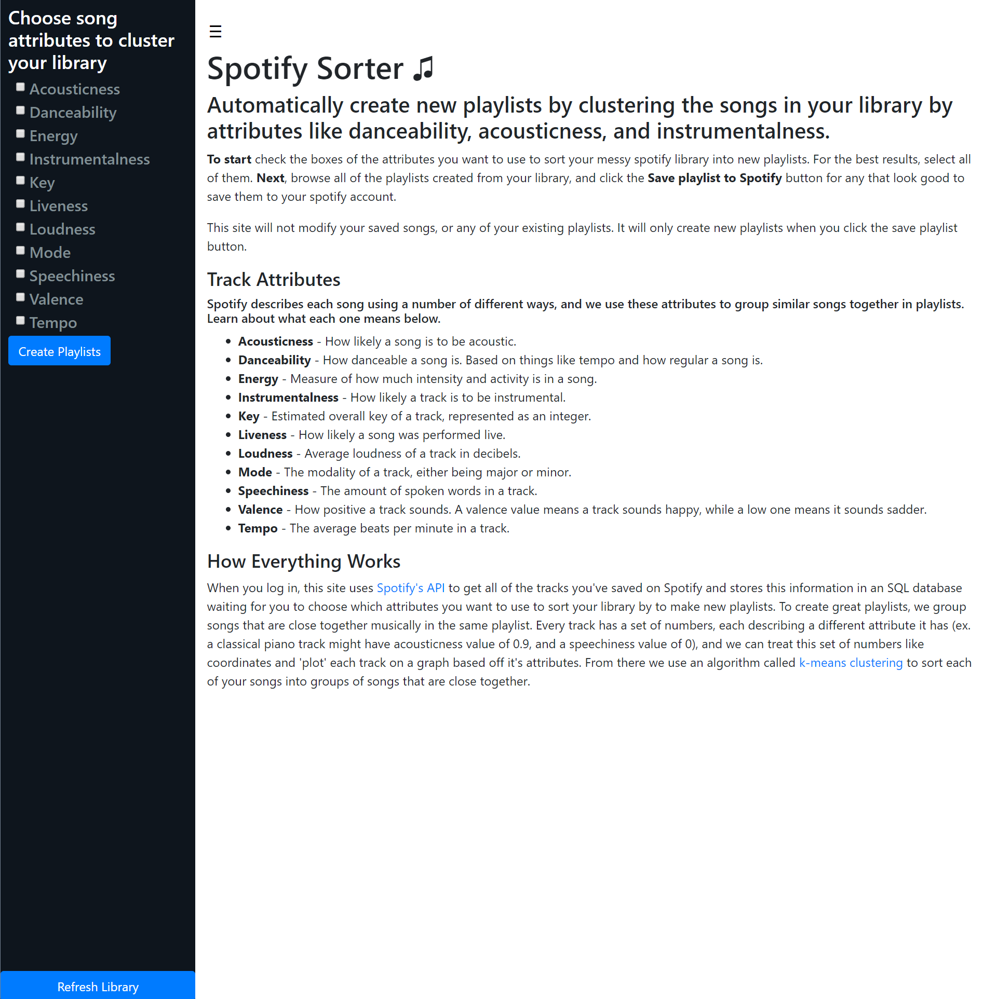
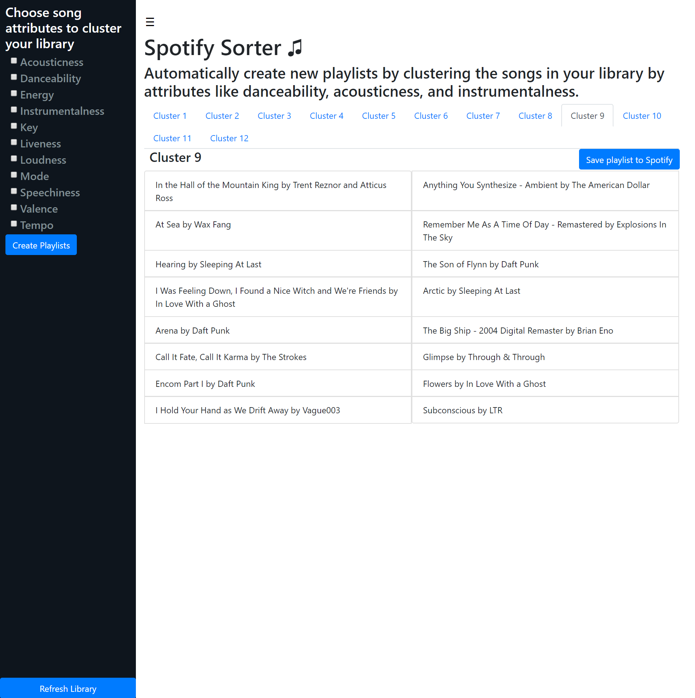

# Spotify Sorter
Website that automatically creates awesome playlists out of your saved songs on Spotify. [Visit it here](http://sorter.sampeters.me)

 ### Motivation
When I hit play saved songs on Spotify, I ran into the issue that there'd be a jarring transition between genres every few tracks. I liked all the music I'd saved, but not at the same time. Think of going from listening to Katy Perry to Radiohead.

Instead of sitting down and manually making playlists for when I was in the mood for different types of music, I decided to make a website that would do it for me. I wanted something that would take the music I had saved to my library, and arrange similar songs into playlists that make sense.
 ### How Songs Are Clustered
Spotify describes each track using a number of different attributes including acousticness, danceability, key, tempo and energy among others. Using this data, my website treats each track as a point in space, and groups together points that are "nearest" to each other into clusters using a version of the k-means clustering algorithm I implemented using the Numpy library.
### Technologies
-  Python/Flask: I used Python/Flask to respond to requests for pages from the website, make calls to Spotify's API, handle OAuth2 authentication, and cluster songs into awesome playlists.
- PostgreSQL:  To avoid repeating the same API calls to Spotify multiple times, I used a database to store the data I received. I used 3 tables, one to store information about users, one to store information about each song, and one to keep track of what songs each user had in their library.
- HTML/CSS/Bootstrap/Javascript: Most of the website is made with plain HTML/CSS, with small amounts of Bootstrap/Javascript thrown in to make it prettier/more interactive.

### Installation

Install with pip:

```
$ pip install -r requirements.txt
```
### Screenshots



